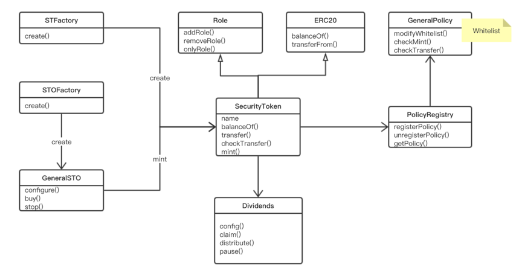

## OpenSecurities Contract

!> The contract code is located in this [git repository](https://github.com/opensecurities-ose/ose-core)


## Structure of Contract


```text
.
└── ose-core
    ├── contracts //the contract code
        ├── dex //the dex contracts
        ├── interfaces
        ├── libraries
        ├── modules
        ├── multisig
        ├── policies
        ├── stos
    ├── play //the playground of the contract interface
    ├── docs //the docs of OpenSecurities
    ├── javaDemo //the demo to show how to call the contract
    ├── test //the test directories
    ├── utils //some help utils
    
```

!> The project depends on `truflle @v4.1.14`, `solidity @v0.4.24`, and `ganache-cli` to simulate the ethereum private network

## Main Contracts


?> Let's take look at the frame of contracts




> Now we will dig into the contract code to make it clear how it works